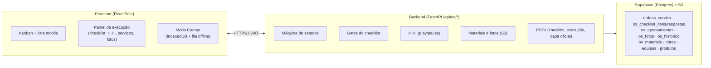
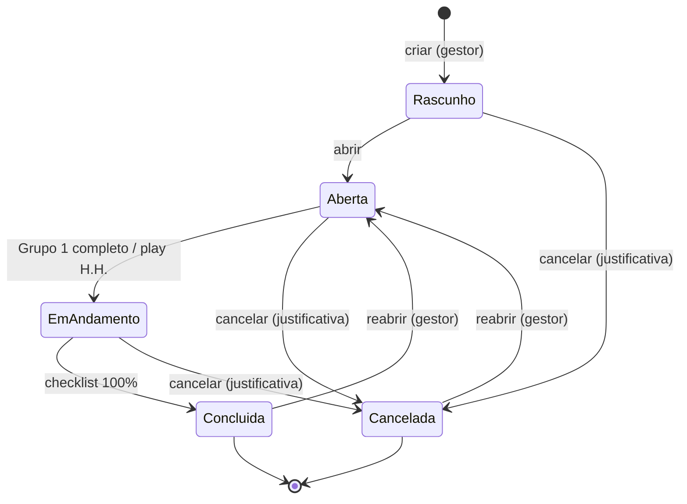
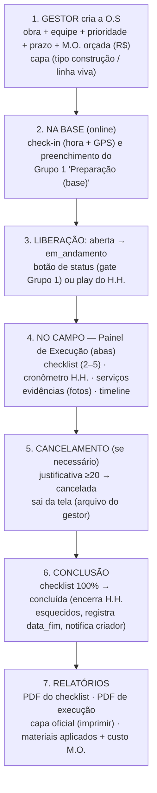
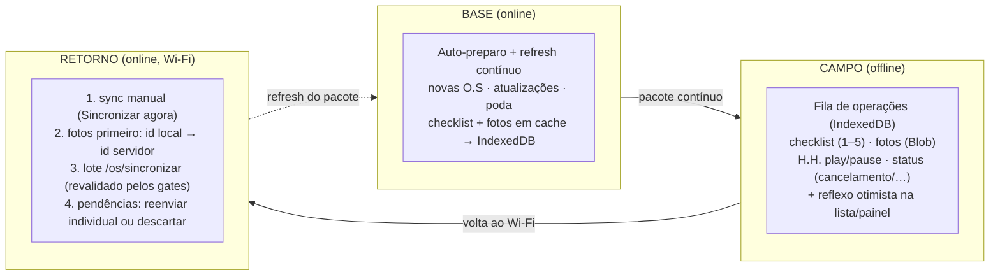

# Diagrama — Módulo Controle de O.S (Ordens de Serviço)

Explicação visual do funcionamento do módulo, passo a passo. Fontes:
`backend/routers/os.py`, `backend/utils/checklist_os.py` e
`frontend/src/pages/OrdensServico.jsx`.

---

## 1. Visão geral da arquitetura



```
┌───────────────────────────┐   HTTPS / JWT   ┌──────────────────────────────┐
│  FRONTEND (React/Vite)    │ ◄─────────────► │  BACKEND (FastAPI /api/os/*) │
│  · Kanban + lista mobile  │                 │  · Máquina de estados        │
│  · Painel de execução     │                 │  · Gates do checklist        │
│  · Modo Campo (IndexedDB) │                 │  · H.H. (play/pause)         │
└───────────────────────────┘                 │  · Materiais e fotos (S3)    │
                                              │  · PDFs (checklist, execução,│
                                              │    capa oficial)             │
                                              └──────────────┬───────────────┘
                                                             │
                              ┌──────────────────────────────▼───────────────┐
                              │  SUPABASE (Postgres) + S3 (fotos)            │
                              │  ordens_servico · os_checklist_itens/respostas│
                              │  os_apontamentos · os_fotos · os_historico   │
                              │  os_materiais · obras · equipes · produtos   │
                              └──────────────────────────────────────────────┘
```

---

## 2. Ciclo de vida da O.S (máquina de estados)



```
                    criar (gestor)
              ┌────────────────────┐
              ▼                    │
         ┌──────────┐              │
         │ Rascunho │              │
         └────┬─────┘              │
              │ abrir              │
              ▼                    │
         ┌─────────┐               │   cancelar (justificativa ≥20)
         │  Aberta ├───────────────┼──────────────►┐
         └────┬────┘               │                │
              │                    │                │
              │ ① Grupo 1 completo │                ▼
              │ ② ou play do H.H.  │           ┌────────────┐
              ▼ (com gate ①)       │           │ Cancelada  │
         ┌──────────────┐          │           └────────────┘
         │Em Andamento  │          │
         └──────┬───────┘          │
                │                  │
                │ cancelar         │
                │ (justificativa)  │
                ├──────────────────┘
                │ checklist 100%
                ▼ respondido
         ┌────────────┐
         │ Concluída  │ (encerra cronômetros abertos)
         └────────────┘
```

**Gates (validações no servidor, `alterar_status`):**

| Transição | Regra |
|---|---|
| `aberta → em_andamento` | Checklist **Grupo 1 (Preparação)** 100% respondido |
| `→ concluida` | Checklist completo (todos os itens de todos os grupos) |
| `→ cancelada` | Justificativa ≥ 20 caracteres (foto opcional); gestor e campo (campo só nas O.S das próprias equipes) |
| `concluida/cancelada → aberta` | Reabertura: gestor + justificativa ≥ 10 caracteres |
| qualquer outra | Rejeitada com 422 (destinos permitidos informados na mensagem) |

---

## 3. Passo a passo do dia (fluxo do usuário)



```
 1. GESTOR cria a O.S (ModalNovaOS)
    · obra + equipe + prioridade + prazo + custo M.O. orçado
    · "capa" (tipo construção/linha viva)
    · O sistema copia o catálogo do checklist → SNAPSHOT fixo na O.S
      (mudanças futuras no catálogo não alteram O.S antigas)

 2. NA BASE (online) — líder faz CHECK-IN (hora + GPS) e abre o painel
    · preenche o Grupo 1 "Preparação (base)" → libera execução

 3. LIBERAÇÃO: aberta → em_andamento
    · via botão de status (gate ①) OU automaticamente ao dar PLAY no H.H.

 4. NO CAMPO — dentro do Painel de Execução (abas):
    · Checklist  ─► grupos 2–5; respostas sim/nao/na; "não" registra a seleção
                    (justificativa opcional); itens podem exigir foto
    · Cronômetro ─► PLAY abre bloco de H.H. (só 1 aberto por pessoa/O.S);
                    PAUSE fecha e calcula minutos; cancelada/concluída não aponta
    · Serviços   ─► lançar serviços com seletor USC normal/especial
                    (peças x fator do cadastro, ex.: 0.48/0.67); estorno só gestor
    · Evidências ─► fotos (câmera/galeria) no S3; excluir só gestor
    · Timeline   ─► histórico de transições (quem/quando/GPS)

 5. CANCELAMENTO (se necessário): justificativa ≥20 → cancelada (sai do
    quadro do campo; fica na visão Encerradas do gestor, que pode reabrir)

 6. CONCLUSÃO: checklist 100% → concluída → encerra cronômetros esquecidos,
    registra data_fim e notifica o criador

 7. RELATÓRIOS: PDF do checklist · PDF de execução · capa oficial (imprimir)
    · resumo de materiais aplicados (USC normal/especial) + custo real de M.O.
```

---

## 4. Modo Campo (offline) — sincronização



```
 BASE (online)            CAMPO (offline)                 RETORNO (online/Wi-Fi)
┌────────────────┐   ┌────────────────────────┐   ┌──────────────────────────┐
│ Auto-preparo   │   │ Ações → fila IndexedDB │   │ 1. sync manual (Wi-Fi)   │
│ + refresh      │   │ · checklist grupos 1-5 │   │ 2. fotos primeiro: id    │
│ contínuo       │──►│ · fotos (Blob local)   │──►│    local → id servidor   │
│ (novas, atual.,│   │ · H.H. play/pause      │   │ 3. lote /os/sincronizar  │
│ poda, fotos)   │   │ · status (cancelamento/…)  │    (revalidado p/ gates) │
│ → IndexedDB    │   │ · reflexo otimista na  │   │ 4. pendências: reenviar  │
└────────────────┘   │   lista/painel         │   │    individual ou descartar
                     └────────────────────────┘   └──────────────────────────┘
```

---

## Permissões

| Perfil | Permissão | Pode |
|---|---|---|
| Gestor | `os` | Criar/editar/cancelar O.S, estornar serviços, excluir evidências, ver tudo |
| Campo | `os_campo` | Executar tarefas (status, H.H., fotos, serviços, imprimir) das O.S das equipes em que atua |

O vínculo do usuário com o funcionário/equipe é feito em **Configurações → Usuários**.
