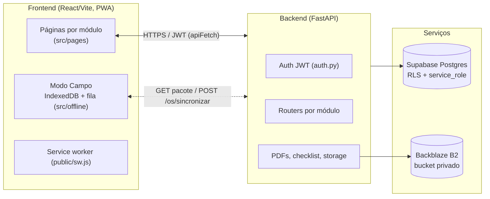

# Arquitetura — App Munaretto

Visão técnica do sistema para quem vai manter ou alterar o código. Para o fluxo
detalhado de O.S (máquina de estados, gates, Modo Campo), ver
[DIAGRAMA_OS.md](DIAGRAMA_OS.md). Implantação: [IMPLANTACAO.md](IMPLANTACAO.md).

## 1. Visão geral



- O frontend é um **PWA** (instalável, service worker próprio) que fala apenas com `/api/*`.
- O backend é a única camada que acessa o banco (chave `service_role`) e o B2.
- Sem banco local no servidor: estado fica no Supabase e no B2.

## 2. Stack e decisões

| Decisão | Escolha | Motivo |
|---|---|---|
| UI | React 18 + Vite + Tailwind | build rápido; PWA sem framework de app |
| API | FastAPI + Pydantic | tipagem, dependências (`Depends`) para auth/permissão |
| Banco | Supabase Postgres com RLS | acesso direto do frontend bloqueado; só o backend acessa |
| Sessão | JWT HS256 (`auth.py`) | simples, stateless; refresh dedicado e renovação automática |
| Offline | IndexedDB + fila de operações | Modo Campo no celular/tablet sem internet |
| Arquivos | Backblaze B2 privado + proxy autenticado | evita expor bucket; CORS controlado |
| PDF/DOCX | docxtpl, openpyxl, fpdf2, pymupdf; LibreOffice no container | conversão confiável no Linux |

## 3. Estrutura de pastas

```
backend/
  main.py            cria o app, CORS, headers de segurança, routers e /health
  auth.py            JWT, get_current_user, require_permissao, rate limiter
  supabase_client.py cliente Supabase (service_role)
  storage.py         upload/download no Backblaze B2
  schema.sql         schema do banco (fonte da verdade, idempotente)
  routers/           endpoints por módulo (18 arquivos)
  utils/             geração de PDFs/modelos, checklist
  tests/             pytest (executar dentro de backend/)
frontend/
  index.html         shell + watchdog anti-tela-branca
  public/sw.js       service worker (cache do app)
  src/main.jsx       bootstrap, overlay global de erros, registro do SW
  src/App.jsx        layout, navegação, sessão, notificações, troca de usuário
  src/modules.js     lista de módulos/permissões exibidos no menu
  src/api.js         apiFetch (token, retry, timeout, 401) e sessão
  src/pages/         uma página por módulo
  src/offline/       Modo Campo: db.js (IndexedDB), offline.js (domínio), sync.js
  src/utils/storage.js  localStorage tolerante a bloqueio (fallback memória)
docs/                esta documentação
render.yaml          Blueprint do backend (Docker) no Render
```

## 4. Autenticação e sessão

- **Login:** `POST /api/usuarios/login` (rate limit por IP/senha via `login_tentativas` e classes em `auth.py`). Retorna `token` (JWT) + dados do usuário.
- **Token:** assinado com `JWT_SECRET`, validade `JWT_VALIDADE_MINUTOS` (padrão 960 = 16 h).
- **Refresh:** `POST /api/usuarios/refresh`; o app renova automaticamente na janela de 10 min antes de expirar (no máximo 1x/min) e mostra banner manual como fallback (`App.jsx`).
- **Frontend:** token em `utils/storage.js` (localStorage com fallback em memória). `apiFetch` injeta `Authorization: Bearer`, aplica timeout de 30 s, retry para GET e trata 401 com `clearToken()` + evento `auth:unauthorized`.
- **Troca de senha:** `POST /api/usuarios/trocar-senha`; usuários criados com senha provisória são forçados a trocar (`TrocaSenhaObrigatoria.jsx`).
- **Admin inicial:** criado no primeiro boot (`lifespan` em `main.py`); senha de `ADMIN_SENHA_INICIAL` ou arquivo `backend/admin_inicial.txt`.

## 5. Autorização e permissões

- Backend (`auth.py`): `get_current_user`, `require_permissao(modulo)` e `require_qualquer_permissao(modulos)` — a validação real acontece no servidor, rota a rota.
- Frontend: `src/modules.js` define os ids de módulo exibidos no menu (`dashboard`, `clientes`, `funcionarios`, `ferias`, `fluxo`, `documentos`, `comprovantes`, `recebimentos`, `devolucoes_celesc`, `manutencao`, `sst`, `os`, `os_campo`, `configuracoes`).
- Perfis usuais: **gestor** (permissão `os`, edição geral) e **campo** (`os_campo`, executa as O.S das equipes em que atua). O vínculo usuário → funcionário/equipe é feito em **Configurações → Usuários**.

## 6. Módulos da API

| Módulo | Página (`src/pages`) | Router (prefixo) | Tabelas principais |
|---|---|---|---|
| Dashboard | `Dashboard.jsx` | `dashboard.py` (`/api/dashboard`) | agrega vários módulos |
| Clientes | `Clientes.jsx` | `clientes.py` (`/api/clientes`) | `clientes`, `documentos_gerados` |
| Funcionários | `Funcionarios.jsx` | `funcionarios.py` (`/api/funcionarios`) | `funcionarios`, `cargos` |
| Gestão Férias | `Ferias.jsx` | `ferias.py` (`/api/ferias`) | `gestao_ferias` |
| Gestão Usinas | `FluxoCaixa.jsx` | `fluxo_caixa.py` (`/api/fluxo-caixa`) | `fluxo_caixa` |
| Documentos | `GeradorDocumentos.jsx` | `documentos.py` (`/api/documentos`) | `documentos_gerados` |
| Contabilidade | `Comprovantes.jsx` | `comprovantes.py` (`/api/comprovantes`) | `comprovantes` |
| Recebimentos | `Recebimentos.jsx` | `recebimentos.py` (`/api/recebimentos`) | `controle_recebimentos` |
| Devoluções Celesc | `DevolucoesCelesc.jsx` | `devolucoes_celesc.py` | `devolucoes_celesc` |
| Manutenção | `Manutencao.jsx` | `manutencao.py` (`/api/manutencao`) | `veiculos`, `manutencoes`, `veiculo_equipamentos`, `equipamento_reposicoes`, `veiculo_documentos` |
| SST | `Sst.jsx` | `sst.py` + `documentos_diversos.py` (`/api/sst`) | `treinamentos`, `matriz_treinamentos`, `funcionario_treinamentos`, `aso`, `epis`, `funcionario_epis`, `sst_documentos` |
| O.S (gestor) | `OrdensServico.jsx` | `os.py` + `apoio_os.py` + `desligamentos_os.py` (`/api/os`) | `ordens_servico`, `os_checklist_*`, `os_apontamentos`, `os_materiais`, `os_fotos`, `os_historico`, `obras`, `equipes`, `equipe_membros`, `produtos`, `os_desligamentos` |
| O.S (Campo) | `OrdensServico.jsx` (modo campo) | mesmas rotas + `POST /api/os/sincronizar` | + `sync_ops` (idempotência) |
| Notificações | sino no `App.jsx` | `notificacoes.py` (`/api/notificacoes`) | `notificacoes` |
| Configurações | `Configuracoes.jsx` | `usuarios.py` (`/api/usuarios`) | `usuarios`, `login_tentativas` |
| Certificados | SST/Documentos | `certificados.py` (`/api/certificados`) | `certificados` (arquivo no B2) |

## 7. Banco de dados

- Fonte da verdade: [`backend/schema.sql`](../backend/schema.sql) — cria tabelas, índices, gatilhos, RLS e é **idempotente**; rode novamente em todo deploy que mexer no schema.
- O RLS habilita acesso apenas com a chave `service_role` (usada só pelo backend). A chave `anon` **não funciona**.
- Convenções: `id` serial/bigint; datas em timestamptz; status como texto controlado no backend (máquinas de estado); PII fora do git.

## 8. Arquivos e geração de documentos

- **B2:** bucket privado; `storage.py` faz upload/download. Fotos de O.S e certificados são servidos por **proxy autenticado** do backend (não expõem o bucket).
- **DOCX/XLSX/PDF:** `docxtpl`, `openpyxl`, `fpdf2`, `pymupdf` e modelos em `utils/`; no Windows a conversão DOCX→PDF usa Word (`docx2pdf`), no Docker usa **LibreOffice** (já instalado na imagem).

## 9. Padrões do frontend

- **Rede:** sempre `apiFetch` (`src/api.js`) — nunca `fetch` cru para a API. Ele cuida de token, timeout, retry de GET e logout em 401.
- **Armazenamento:** `src/utils/storage.js` (nunca `localStorage` direto).
- **Erros:** `ErrorBoundary` (App) + overlay global em `main.jsx` + watchdog no `index.html` (com "Limpar dados e recarregar").
- **PWA/service worker** (`public/sw.js`, v5): navegação network-first com timeout de 3 s e fallback do shell em cache; assets com hash em cache-first; demais GET em stale-while-revalidate; migração de assets no `activate`. Contexto e critérios: [decisoes/PLANO_FIX_TELA_BRANCA_PWA.md](decisoes/PLANO_FIX_TELA_BRANCA_PWA.md).
- **Modo Campo** (`src/offline/`): `db.js` = IndexedDB (`os`, `checklist`, `os_lista`, `fila`, `fotos`, `fotos_cache`, `meta`); `offline.js` = pacote/refresh/fila/leituras; `sync.js` = envio (fotos primeiro, depois lote) com idempotência (`sync_ops`). Fluxo em [DIAGRAMA_OS.md](DIAGRAMA_OS.md).

## 10. Banco, schema e ambientes

- `APP_ENV=development` habilita `/docs`; qualquer outro valor (padrão) trata como produção (sem Swagger, HSTS, logs JSON).
- CORS por `CORS_ORIGINS`; host header por `TRUSTED_HOSTS` (opcional); cabeçalhos de segurança aplicados a todas as respostas (`main.py`).
- Variáveis: [`backend/.env.example`](../backend/.env.example) e [`frontend/.env.example`](../frontend/.env.example).

## 11. Testes e qualidade

- **Backend:** `pytest` dentro de `backend/` (~20 arquivos; cobrem auth, sync offline, checklist, PDFs, importação etc.). Lint/format: `ruff` (config em `backend/pyproject.toml`, linha 120) — rode nos arquivos alterados.
- **Frontend:** `npm test` (vitest + jsdom) — `api`, `offline`, `sync`, componentes pontuais e o service worker. `npm run lint` (ESLint flat + hooks).
- Não há CI configurado: rode os comandos manualmente antes de subir (ver [../CONTRIBUTING.md](../CONTRIBUTING.md)).

## 12. Dívida técnica conhecida

- **Arquivos grandes:** `backend/routers/os.py` (~2,8 mil linhas), `apoio_os.py` (~1,9 mil), `frontend/src/pages/OrdensServico.jsx` (~6,7 mil), `Sst.jsx` (~2,9 mil). Mudanças nesses arquivos pedem cuidado extra; o `DIAGRAMA_OS.md` ajuda no caso de O.S.
- **Cobertura de UI baixa:** a lógica crítica tem testes, mas há poucos testes de componentes/páginas.
- **Bundle único ~885 kB** (aviso do Vite): sem code splitting; avaliar `manualChunks`/lazy se crescer.
- **Sem CI**: risco de lint/test esquecidos; documentado no CONTRIBUTING.
- **Lint do backend com dívida antiga**: `ruff check .` acusa ~29 violações pré-existentes (linhas longas em `os.py`, imports não usados em testes) e 26 arquivos fora do `ruff format` — limpar por partes, sem misturar com correções.

## 13. Deploy

Resumo: Supabase (schema) → Render (Docker, `render.yaml`) → Vercel (`frontend`, `VITE_API_URL`) → B2. Passo a passo completo em [IMPLANTACAO.md](IMPLANTACAO.md).
